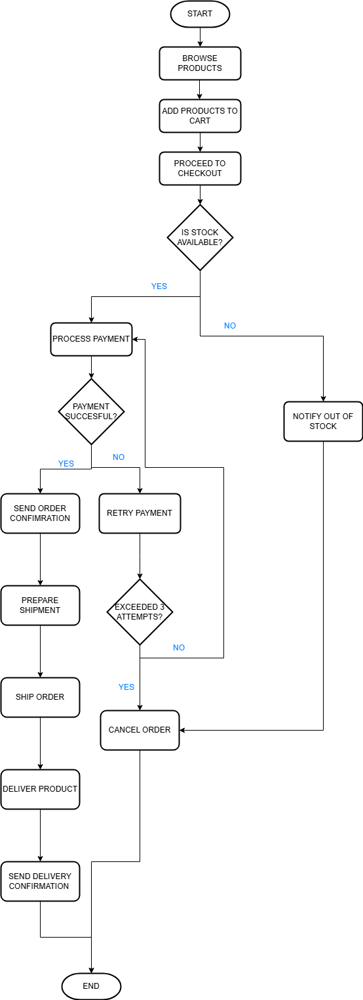

# Online Order Process

This project models a typical online order process for an e-commerce platform. It includes a process flowchart and a business requirements document, describing the key steps, decision points, and business rules involved in completing an online order.

## Project Structure
- **Online_Order_Process_Diagram.png** – Flowchart illustrating the online order process.
- **Business_Requirements_Document.pdf** – Document detailing the actors, process steps, and business rules.

## Purpose
The purpose of this project is to demonstrate business process modeling skills, clear documentation of functional requirements, and understanding of workflow optimization for an e-commerce system.

## Tools Used
- **Draw.io** – For creating the flowchart diagram.
- **Microsoft Word** – For writing the business requirements document.

## Process Overview
The online order process involves the following main steps:
1. The customer browses products and adds items to the cart.
2. During checkout, the system checks if the items are in stock.
3. If products are available, payment processing begins.
4. In case of payment failure, the customer can retry up to 3 times before the order is canceled.
5. Upon successful payment, the system sends an order confirmation.
6. The warehouse prepares and ships the order.
7. The delivery service delivers the product to the customer.
8. A delivery confirmation is sent to the customer.

If at any point stock is unavailable, or the maximum number of payment attempts is exceeded, the order is canceled.

## Diagram Preview

## Business Rules Summary
- Products must be in stock to proceed with payment.
- A maximum of 3 payment retries is allowed; otherwise, the order is canceled.
- Order confirmation must be sent within 5 minutes after successful payment.
- Delivery confirmation must be sent within 24 hours after shipping.
- Immediate notification must be sent if a product is out of stock.

## Improvements or Future Work
- Implement stock reservation during checkout to prevent overselling in high-demand scenarios.
- Integrate multiple payment gateways to provide customers with additional options.
- Add fraud detection checks during the payment process for enhanced security.
- Enable real-time order tracking by integrating warehouse and delivery systems.
- Provide automated customer notifications for order status updates (pre-shipment, shipping, delivery).
